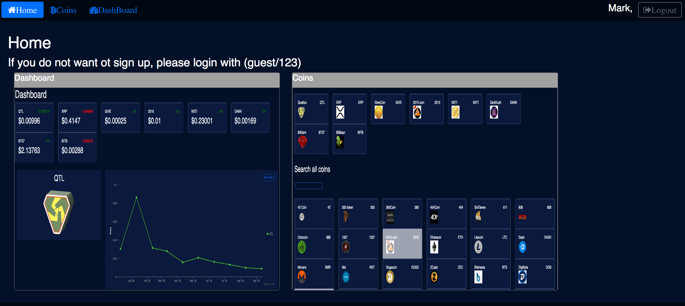

## How to run it
  - [npm start](#npm-start)
  - [npm test](#npm-test)
  - [npm run build](#npm-run-build)
  - [npm run eject](#npm-run-eject)

## How to run it without updating Cassandra
- in terminal 1, launch mongoDB
- in terminal 2, launch Cassandra
- in terminal 3, launch server (node server/app.js)
- in terminal 4, launch client (./serve/bin/serve.js -s build)

## How to run it withupdating Cassandra
- in terminal 1, launch mongoDB
- in terminal 2, launch Cassandra
- in terminal 3, launch zookeeper server
- in terminal 4, launch kafka server
- run CryptocurrencyKafkaStreaming/src/main/java/cryptocurrency/kafka/CoinProducer.java
- run CryptocurrencyKafkaStreaming/src/main/java/cryptocurrency/kafka/CoinConsumer.java
- run CryptocurrencyKafkaStreaming/src/main/java/cryptocurrency/kafka/CoinVolatility.java
- in terminal 5, launch server (node server/app.js)
- in terminal 6, launch client (./serve/bin/serve.js -s build)

## Demo
